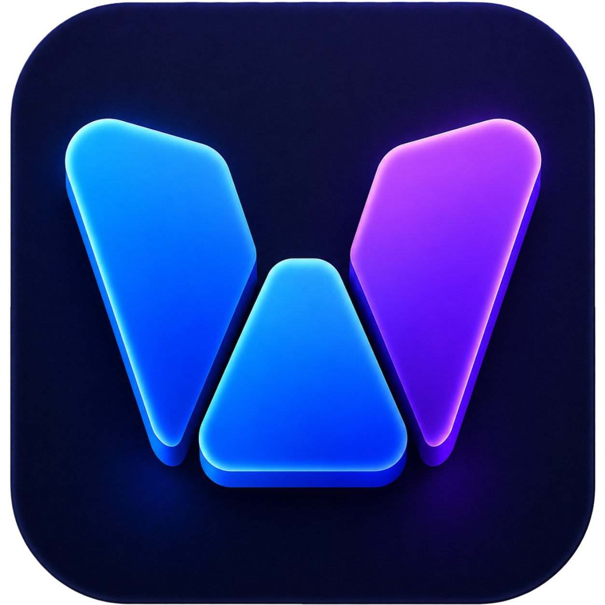

<div align="center">
  
  <h1>WebDock</h1>
  <p><strong>Your web apps. One dock. Blazing fast.</strong></p>
  
  [](https://opensource.org/licenses/MIT)
  [](https://github.com/chriz-3656/webdock/actions)
  [](https://electronjs.org/)
</div>

<hr>

## 🚀 Overview

WebDock is a high-performance, minimalist desktop environment designed to transform your favorite websites and web applications into standalone, native-feeling desktop apps. 

Tired of having 50 browser tabs open just to keep track of GitHub, Figma, Spotify, and Slack? WebDock strips away the heavy browser chrome, URL bars, and extension overhead, presenting your apps in a unified, distraction-free dock. 

### Why WebDock?
Standard Electron apps often bundle a massive chromium instance for *every single app* you install (Slack, Discord, Spotify, etc). WebDock solves this by acting as a **single unified container**. You run ONE instance of WebDock, and it elegantly hosts all of your web apps in isolated, sandboxed native `WebContentsView` partitions.

## ✨ Key Features

- **⚡ Blazing Fast Performance**: By bypassing standard browser rendering engines and using Electron's raw `WebContentsView` API, WebDock minimizes RAM and CPU usage.
- **🛡️ Sandboxed Security**: Every website you add runs in a fully isolated session partition. Your cookies, logins, and trackers cannot bleed between apps.
- **🎨 Beautiful Native UI**: Built from the ground up with raw CSS, smooth micro-animations, custom SVG iconography, and a perfectly integrated dark mode theme.
- **🔋 Dynamic Tab Management**: When you switch tabs, WebDock intelligently manages background processes to return resources to your machine.
- **🎛️ Total Customization**: Easily add any custom website to your sidebar with auto-fetching favicons. Group them by category for the perfect workflow.

## 📦 Installation & Usage

### Downloading Pre-built Installers
Head over to the [Releases](https://github.com/chriz-3656/webdock/releases) page to download the latest `.exe` (Windows), `.dmg` (macOS), or `.AppImage` / `.deb` (Linux) installers.

### Running from Source
To run WebDock locally for development or testing:

```bash
# 1. Clone the repository
git clone https://github.com/chriz-3656/webdock.git

# 2. Navigate to the project directory
cd webdock

# 3. Install dependencies
npm install

# 4. Start the application
npm start
```

## 🛠️ Building for Production

WebDock uses `electron-builder` to package native cross-platform executables. 

```bash
# Compile TypeScript into native JavaScript
npm run build

# Package the application into standalone executables
npm run dist
```
Your compiled binaries will be cleanly generated in the `dist/` directory.

## ⌨️ Keyboard Shortcuts

| Shortcut | Action |
|----------|--------|
| `Ctrl+Shift+I` | Open Developer Tools for the active web app |
| `Ctrl+T` | (Coming Soon) Open new tab prompt |
| `Ctrl+W` | (Coming Soon) Close current tab |

## 🏗️ Architecture

WebDock is built on the latest Electron stack with rigorous performance optimizations:
- **Main Process (`main.ts`)**: Manages the native `BaseWindow`, intercepts OS-level IPC calls, and securely spins up isolated `WebContentsView` containers.
- **Preload Script (`preload.ts`)**: Acts as a secure, context-isolated bridge between the Node.js backend and the DOM frontend.
- **Renderer (`renderer.ts`)**: A completely vanilla, framework-less frontend. Zero React, zero Vue, zero overhead. Just raw, optimized DOM manipulation for absolute maximum speed.

## 🤝 Contributing

We welcome contributions of all kinds! Whether it's a new feature, a bug fix, or visual polish, we'd love your help making WebDock better.

Please review our [Contributing Guidelines](CONTRIBUTING.md) and our [Code of Conduct](CODE_OF_CONDUCT.md) before submitting a pull request.

## 📄 License

This project is licensed under the [MIT License](LICENSE).